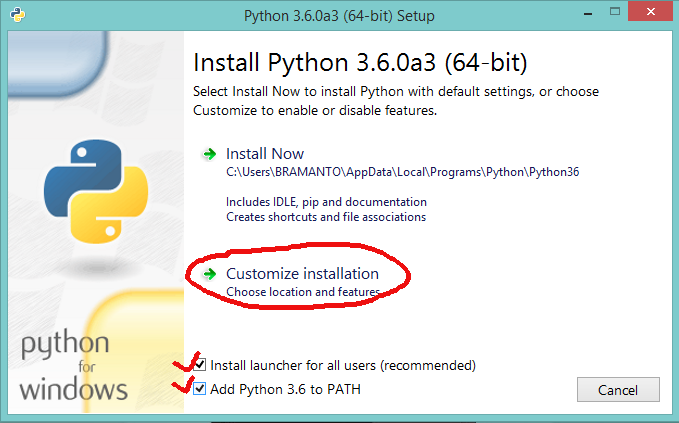
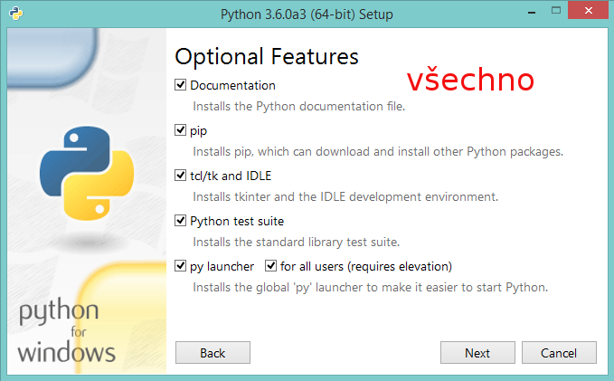
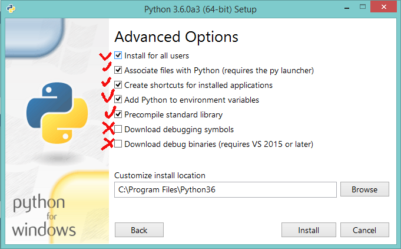
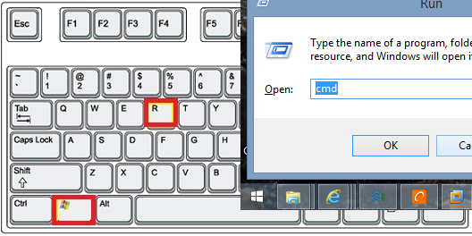

Online zdroje
=======================

 * Velice zdařila komunitní stránka je <http://python.cz>. Najdete tu vše, co 
   začátečník potřebuje včetně diskusních skupin a chatu.
 
 * Rozcestník pro začátečníky najdete na <https://python.cz/zacatecnici/>.

 * <http://naucse.python.cz/>
    * [Začátečnický kurz](http://naucse.python.cz/course/pyladies/).
    * [Kurz pro pokročilé](http://naucse.python.cz/course/mi-pyt/).

 * Jako učebnici budeme používat knihu **Ponořme se do Pythonu 3**:
     - [HTML](http://diveintopython3.py.cz/index.html)
     - [... PDF a další formáty](https://knihy.nic.cz/#Python3)

 * Návody vytvořené u nás ve škole:
    - [grafické uživatelské rozhranní s PyQt4](http://spseol.github.io/PyQt4Doc/)
    - [Flask a Jinja2](http://spseol.github.io/CzechFlaskDoc/)
    - [Český manuál k MatPlotLib](http://mamut.spseol.cz/matplotlib/)

 * Komunita:
    - [Pyvec](http://pyvec.org/)
    - [Pyvo](https://pyvo.cz/)

Instalace
=======================

Budeme používat Python 3. Jeho instalátor si stáhnete z oficiálních stránek
<http://python.org/>. Stačí kliknout na [Downloads](https://www.python.org/downloads/).

Při instalaci zadejte **Install Launcher** a **Add Python to PATH**. 
Nainstalujte si i **pip**. Pokud nic nebudete měnit měl by se vám Python 
nainstalovat do *Program Files\Python36*

Uživatelé OS **Linux** už mají nejspíš Python3 nainstalovaný. Pokud ne, stačí 
spustit něco jako 

    apt install pytho3 idle3 python3-tk python3-venv python3-pip 

Knihovny
===================

Pro naši výuku, práci a také pro naše pohodlí budeme potřebovat několik knihoven.
Ty se dají snadno spravovat -- tedy (od/na)instalovat pomocí nástroje 
[pip](https://pip.pypa.io/en/stable/). Takto se dají instalovat nejen knihovny,
ale i programy napsané v Pythonu.

Stačí otevřít příkazovou řádku:

Knihovny pro matematické výpočte a vykreslování grafů jsou 
[NumPy][] a [Matplotlib][].

    pip3 install numpy matplotlib

Pro interaktivní práci a psaní poznámek budeme potřebovat [IPython][] a
[Jupyter][]. 

    pip3 install ipython jupyter

Pro psaní zdrojového kódu se hodí vývojové prostředí [Spyder][].

    pip3 install PyQt5
    pip3 install spyder

Pro vytváření webových stránek se hodí [Flask][].

    pip3 install flask

Pro komunikaci s databázovým serverem [PostgreSQL][] se hodí [psycopg][].

    pip3 install psycopg2

**Spustitelné soubory všech programů**, které jste si nainstalovali najdete
v adresáři *Program Files\Python 3.6\scripts*. Například

 * spyder3.exe
 * jupyter-notebook.exe
 * ... nebo tak nějak

[NumPy]: http://www.numpy.org/
[Matplotlib]: http://matplotlib.org
[Flask]: http://flask.pocoo.org/
[PostgreSQL]: http://postgres.cz/
[psycopg]: http://initd.org/psycopg/
[IPython]: http://ipython.org/
[Jupyter]: https://jupyter.org/
[Spyder]: https://pythonhosted.org/spyder/

V Linuxu by tento postup měl fungovat také, ale obecně není příliš dobré míchat
v ekosystému knihoven knihovny z repositářů vaší distribuce s knihovnami přímo
staženými z up-streamu. Proto buď knihovny instalujte jen pro daného uživatele použitím parametru `--user`.

    pip3 install --user numpy matplotlib

... nebo se držte balíčků vaší distribuce

    apt install python3-numpy python3-matplotlib spyder3 ipython3 jupyter-qtconsole jupyter-notebook

... nebo tak nějak.

Editory
====================

Git a GitHub
=========================

* [Git rychlokurs](http://naucse.python.cz/lessons/git/basics/)

Notebook
=======================
